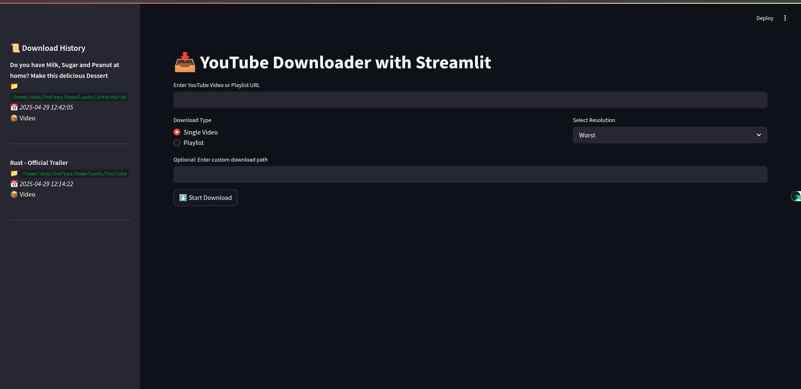
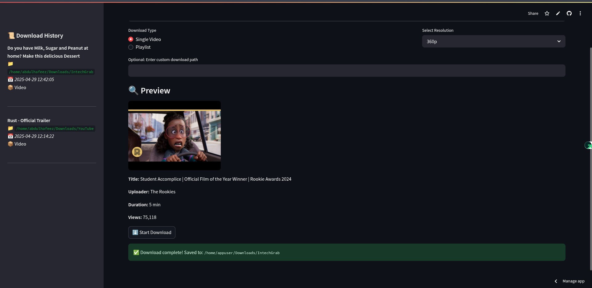

# 🎥 YouTube Downloader App (Streamlit + yt-dlp)

This is a simple yet powerful web app to download YouTube videos or playlists using [yt-dlp](https://github.com/yt-dlp/yt-dlp), built with [Streamlit](https://streamlit.io/).

---

## 🚀 Features

- 📥 Download single videos or full playlists
- 🎯 Choose from various resolutions (1080p, 720p, 480p, etc.)
- 🔍 View video metadata preview before downloading
- 🕒 Sidebar for download history
- 🗂 Option to specify custom download directory (for local use)

---

## 🖥 Live Demo

> 🔗 [Click here to try it online](https://ytgrab.streamlit.app/)

---

## 📸 Screenshots




---

## ⚙️ Installation

<!-- Clone the repository:

```bash
git clone https://github.com/your-username/your-repo-name.git
cd your-repo-name -->
